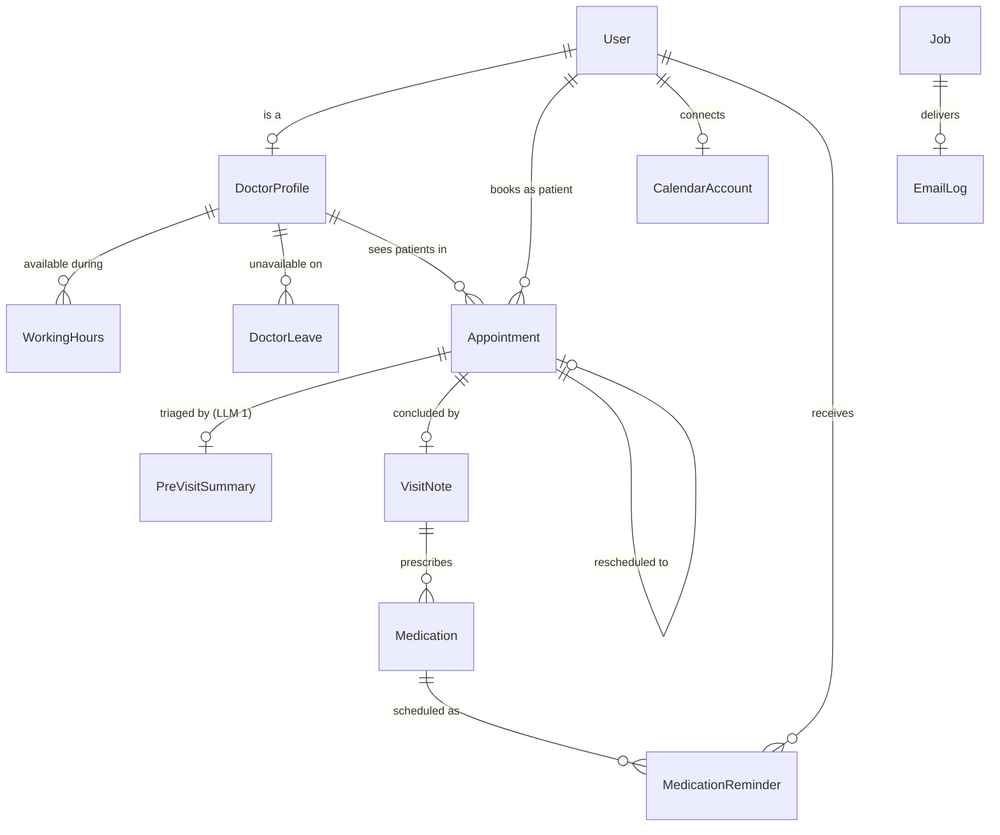

# Database schema

Postgres, managed with Prisma. Full definition: [`server/prisma/schema.prisma`](../server/prisma/schema.prisma).
Two migrations: `init` (tables) and `booking_guards` (the constraints below,
written as raw SQL because Prisma cannot express partial indexes).

## Diagram



## Tables

### Identity

**`User`** — one table for all three roles, discriminated by `role`
(`PATIENT` / `DOCTOR` / `ADMIN`). Holds `email` (unique), `passwordHash`
(bcrypt), `fullName`, `phone`, `isActive`, and patient-only `dateOfBirth` /
`gender`. Deactivation is a flag, never a delete — appointment history is a
clinical record.

**`DoctorProfile`** — 1:1 with a `DOCTOR` user. Carries `specialisation`
(indexed, drives patient search), `qualifications`, `bio`, `roomNumber`,
`consultationFee` (minor units), `slotDurationMinutes` (**defines the booking
grid**), `bookingHorizonDays`, `isAcceptingPatients`.

### Availability

**`WorkingHours`** — a recurring weekly window: `dayOfWeek` (0 = Sunday),
`startTime`, `endTime` as `"HH:MM"` in the clinic timezone. A doctor may have
several per day (morning and evening clinics). Unique on
`(doctorId, dayOfWeek, startTime)`.

**`DoctorLeave`** — a whole-day absence: `date` (Postgres `DATE`, midnight UTC
of the clinic-local day), `reason`. Unique on `(doctorId, date)`.

### Appointments

**`Appointment`** — the centre of the model.

| Column | Purpose |
|---|---|
| `doctorId`, `patientId` | the two parties |
| `startsAt`, `endsAt` | UTC instants; `(doctorId, startsAt)` is the uniqueness key |
| `status` | `HELD` → `BOOKED` → `COMPLETED`, or `CANCELLED` / `EXPIRED` / `NO_SHOW` |
| `holdExpiresAt`, `holdToken` | the slot-hold mechanism |
| `symptoms`, `patientNotes` | patient input; feeds the pre-visit LLM |
| `cancelledAt`, `cancelledBy`, `cancelReason` | why it ended — `DOCTOR_LEAVE` is its own reason |
| `rescheduledFromId` | self-relation linking a replacement to the original |
| `patientCalendarEventId`, `doctorCalendarEventId`, `calendarSyncStatus` | per-party Google events |

**Status semantics.** A slot is *occupied* while an appointment on it is `HELD`
(unexpired), `BOOKED`, or `COMPLETED`. `CANCELLED`, `EXPIRED` and `NO_SHOW` free
the slot while staying in the record.

### AI-assisted content

**`PreVisitSummary`** (1:1 with an appointment) — `rawSymptoms` kept verbatim
for audit, plus `chiefComplaint`, `summary`, `urgency`
(`LOW`/`MEDIUM`/`HIGH`), `urgencyRationale`, `suggestedQuestions[]`,
`redFlags[]`.

**`VisitNote`** (1:1) — the doctor's `doctorNotes`, `diagnosis`,
`prescriptionText`, `followUpInDays`; and the patient-facing `patientSummary`,
`careInstructions[]`, `warningSigns[]`.

Both carry `source` — `LLM`, `HEURISTIC`, `PENDING` or `UNAVAILABLE` — along
with `model`, `attempts` and `lastError`. **This provenance field is what lets
the UI be honest about degraded output** rather than passing a keyword match off
as a model summary.

**`Medication`** — one prescribed drug normalised out of the prescription text:
`name`, `dosage`, `frequency`, `timesOfDay[]` (`"HH:MM"`), `durationDays`,
`instructions`, and `parsedByFallback` (true when the rule-based parser supplied
the times rather than the model).

**`MedicationReminder`** — one row per dose per day, materialised up front. That
costs rows but means the patient can *see* their schedule, a single dose can be
cancelled without unpicking a recurrence rule, and stopping a course is one
`UPDATE`.

### Infrastructure

**`Job`** — the Postgres-backed queue. `type`, `payload` (JSON), `status`,
`runAt` (backoff pushes this forward), `attempts` / `maxAttempts`, `lastError`,
`errorLog` (full per-attempt history), `lockedAt` / `lockedBy` (crash recovery),
`retryOfId`. Living in Postgres lets a job be enqueued *in the same transaction*
as the state change that caused it.

**`EmailLog`** — every attempted email with its rendered body, so a
dead-lettered notification can be inspected and resent.

**`CalendarAccount`** — per-user OAuth grant: tokens, `expiresAt`, `calendarId`,
`isActive`. Absent simply means that user's calendar sync is skipped.

## Constraints that carry the guarantees

```sql
-- No two active appointments may occupy one doctor's slot.
-- Filtered on status so a cancelled appointment does not burn the slot forever.
CREATE UNIQUE INDEX appointment_active_slot_uniq
  ON "Appointment" ("doctorId", "startsAt")
  WHERE "status" IN ('HELD', 'BOOKED', 'COMPLETED');

-- A patient cannot be in two clinics at the same instant.
CREATE UNIQUE INDEX appointment_patient_slot_uniq
  ON "Appointment" ("patientId", "startsAt")
  WHERE "status" IN ('HELD', 'BOOKED', 'COMPLETED');

-- An appointment occupies a positive interval.
ALTER TABLE "Appointment"
  ADD CONSTRAINT appointment_interval_positive CHECK ("endsAt" > "startsAt");

-- "Expired hold" is a total function of (status, holdExpiresAt) — the
-- application cannot forget to maintain one of the two.
ALTER TABLE "Appointment"
  ADD CONSTRAINT appointment_hold_expiry_consistent
  CHECK (("status" = 'HELD') = ("holdExpiresAt" IS NOT NULL));

-- Working-hours windows are well-formed and non-empty.
ALTER TABLE "WorkingHours"
  ADD CONSTRAINT working_hours_format CHECK (
    "startTime" ~ '^([01][0-9]|2[0-3]):[0-5][0-9]$' AND
    "endTime"   ~ '^([01][0-9]|2[0-3]):[0-5][0-9]$' AND
    "startTime" < "endTime");
```

Supporting partial indexes keep the hot paths cheap: `appointment_active_holds_idx`
for the hold sweeper and `job_claimable_idx` for the queue's claim query.

## Time handling

Every instant is stored in UTC. The clinic timezone (`CLINIC_TIMEZONE`) is
applied only at the edges — expanding `"Monday 09:00–13:00"` into concrete
instants, and formatting for humans. `DoctorLeave.date` is a `DATE` at UTC
midnight of the clinic-local day. DST transitions are handled by a two-pass
offset resolution in `server/src/lib/time.js`.
